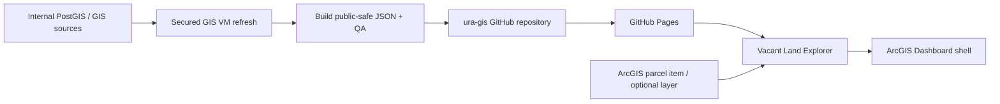

# Vacant Land Dashboard Handover

This is the quick-start for the Vacant Land Redevelopment Explorer after the repository transfer to `ura-gis`.

## What this product does

- **Map Monitor:** explores eligible Pittsburgh parcels with map signals, filters, labels, charts, table review, custom lists, and exports.
- **Ownership view:** gives a focused owner/control review using the same published parcel bundle.
- **ArcGIS front door:** item `9552e95d319b4e2180219ae66b3c8d65` embeds the GitHub Pages app.
- **Data worker:** the secured GIS VM refreshes internal extracts, rebuilds the public-safe JSON copies, runs fail-closed QA, and publishes to `main`.

Live links:

- App: <https://ura-gis.github.io/land_redevelopment_dashboard/>
- Ownership: <https://ura-gis.github.io/land_redevelopment_dashboard/ownership>
- ArcGIS Dashboard: <https://urap.maps.arcgis.com/apps/dashboards/9552e95d319b4e2180219ae66b3c8d65>
- Repository: <https://github.com/ura-gis/land_redevelopment_dashboard>

## Source and data flow

ArcGIS is the preferred live source when configured. The app falls back to the versioned `docs/data/` bundle so the public page remains usable if an ArcGIS item is unavailable. Keep `docs/data/` and `webmap/data/` aligned.

## Three operating activities

### Daily check

1. Open the Pages app and the ArcGIS Dashboard.
2. Confirm the freshness panel, parcel count, map filters, ownership view, and one export.
3. On the VM, inspect `C:\srv\logs\land-redevelopment-dashboard\daily-refresh-status.json` and the dated transcript.
4. Confirm the scheduled task completed and that only expected data files changed.

### Failure recovery

1. Do not publish partial data. Read the status JSON and full log first.
2. Check PostgreSQL, source extract freshness, ArcGIS reachability, and ownership QA.
3. Re-run the documented refresh command from [Daily refresh VM operations](docs/daily-refresh-vm-operations.md) after fixing the source issue.
4. If the VM cannot publish, keep the last known-good `main` data and escalate; never commit secrets or ad-hoc exports.

### Deploy a change

1. Create a `codex/` branch, make the smallest source-controlled change, and update the relevant documentation/tests.
2. Run the Python validation scripts and Pages smoke checks locally.
3. Open a pull request into `main`; merge only after review and a healthy Pages deployment.
4. If the ArcGIS shell URL or item configuration changes, update [ArcGIS Online publishing notes](docs/arcgis-online-publishing.md) and verify the shell after deployment.

## Owners and escalation

| Area | Primary | Backup / escalation |
| --- | --- | --- |
| GitHub repository and Pages | `ura-gis` organization owners | GIS lead; keep two owners |
| ArcGIS items and dashboard shell | URA GIS analyst | GIS lead / ArcGIS administrator |
| VM refresh and PostgreSQL extracts | GIS automation owner | Infrastructure administrator |
| Product interpretation | Land redevelopment program owner | GIS lead |

Use the repository issue/PR for code and data defects. Escalate source outages or access problems to the GIS automation owner; escalate metric or ownership questions to the program owner before changing calculations.

## Handover checklist

- **Day −5:** confirm two GitHub organization owners, the VM service account/deploy key, ArcGIS item ownership, Pages settings, scheduled task, and current QA artifacts.
- **Day −1:** run a checked refresh, review the dashboard with the incoming analyst, and record the current parcel count and source dates.
- **Cutover day:** transfer the repository, update local/VM remotes, merge the cutover PR to `main`, verify Pages and ArcGIS embedding, then resume the VM task.
- **Day +2:** verify two scheduled cycles, remove former intern access, rotate old credentials, and have the new owner make one small Codex change through PR and deployment.

## Canonical references

- [Architecture and data flow](docs/landcare-webapp-patterns-for-vacant-land.md)
- [Daily refresh VM operations](docs/daily-refresh-vm-operations.md)
- [ArcGIS Online publishing notes](docs/arcgis-online-publishing.md)
- [Latest ownership QA](docs/latest_ownership_qa.md)
- [Table data coverage](docs/table-data-coverage.md)
- [README](README.md)

Never place passwords, tokens, deploy keys, database credentials, or Actions secret values in this repository or handover notes.
