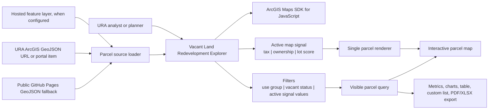
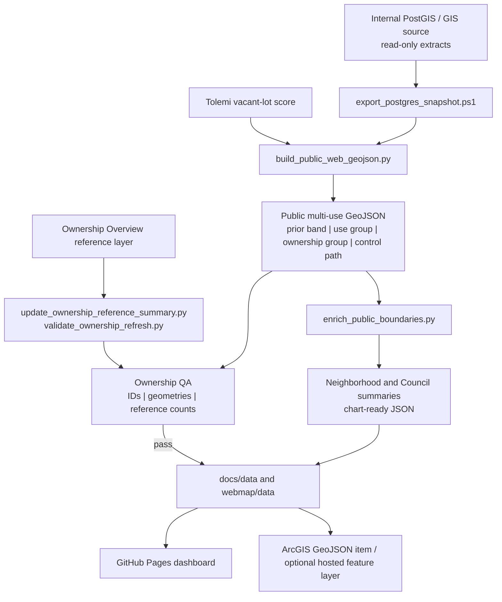

# Vacant Land Redevelopment Explorer

The Vacant Land Redevelopment Explorer is an interactive URA map for exploring Pittsburgh vacant-land patterns. It keeps the map-first workflow familiar to ArcGIS users while adding parcel filtering, map signals, metrics, charts, table review, and export tools for redevelopment analysis.

## Live Entries

- Dashboard: <https://rutomo-ura.github.io/land_redevelopment_dashboard/>
- Ownership view: <https://rutomo-ura.github.io/land_redevelopment_dashboard/ownership>
- URA Maps item: <https://urap.maps.arcgis.com/home/item.html?id=012020b806e74ca6b59606d38f2e318a#overview>
- Source web map: <https://urap.maps.arcgis.com/apps/mapviewer/index.html?webmap=19022018e35b4b72a2d30cba2d56c8e2>

The URA Maps item is a separate `Document Link` to the GitHub Pages dashboard. It does not replace, modify, or depend on the LandCare monitoring app.

## Current Product State

The deployed dashboard currently provides:

- An ArcGIS Maps SDK parcel map with a residential default view.
- One parcel-color rule: parcels always follow the selected map signal.
- Map signals for tax delinquency, ownership, and Tolemi vacant-lot score.
- Property-use and vacant-status filters, bookmarks, summary metrics, charts, a review table, custom lists, and PDF/XLSX exports.
- Ownership colors aligned to the requested convention: City Owned is yellow, URA Owned is cyan blue, and PLB Owned is dark green.
- Tax bands shown as `11+ prior years` red, `5-10 prior years` orange, and `1-4 prior years` yellow.
- A public-safe fallback data bundle for when an ArcGIS service is unavailable.

The public multi-use bundle contains 30,259 features. After dashboard exclusions for infrastructure, rail, and right-of-way polygons, the map presents 29,783 eligible parcels. The default residential view contains 20,663 parcels, including 3,603 with 11+ prior years, 843 with 5-10 prior years, and 1,962 with 1-4 prior years.

## How It Works



At load time, the app tries a configured hosted feature layer first, then the URA ArcGIS GeoJSON URL, then the ArcGIS portal item, and finally the versioned public GeoJSON in `docs/data/`. This means the published map remains usable while a private or unavailable ArcGIS source is being corrected.

Changing a map signal changes the parcel field used by the renderer and the legend, counts, charts, table context, and exports. Property use is a checklist filter only; it does not introduce a competing parcel-color scheme.

## Data Engineering



The public web layer is intentionally derived rather than copied directly from the internal database. The build removes raw owner names and connection details, derives `prior_band` from tax history, maps county assessment `usedesc` values to a public `use_group`, and stores public-safe `ownership_group` and `control_path` values. Centroid joins against authoritative WPRDC City neighborhood and 2022 Council boundaries supply the chart summaries.

Ownership QA is independent of the public GeoJSON: the Ownership Overview reference layer is the source of truth for ownership summary checks. The latest recorded validation passed with zero ownership-summary mismatches, duplicate parcel IDs, missing parcel IDs, or missing geometries. See [docs/latest_ownership_qa.md](docs/latest_ownership_qa.md) and [docs/latest_export_summary.md](docs/latest_export_summary.md) for the recorded output.

## Refresh And Publish

Run the data refresh from approved internal access, then rebuild and validate before publishing public files:

```powershell
# Read-only internal extract
powershell -ExecutionPolicy Bypass -File scripts\export_postgres_snapshot.ps1

# Public-safe bundle and boundary summaries
python scripts\build_public_web_geojson.py
python scripts\enrich_public_boundaries.py

# Ownership reference refresh and QA
python scripts\update_ownership_reference_summary.py
python scripts\validate_ownership_refresh.py
```

Commit the resulting public files under `docs/` only after QA passes. GitHub Pages deploys from `main` and serves the dashboard directly. The ArcGIS Online Document Link item should continue to target that same dashboard URL; publishing details are in [docs/arcgis-online-publishing.md](docs/arcgis-online-publishing.md).

## Accomplished

- Separate URA Maps content item created for the redevelopment dashboard, linked to the GitHub Pages application.
- ArcGIS-first parcel source wiring with a reliable public fallback.
- Parcel geometry aligned to the current PostGIS-derived public export, including exclusion of non-parcel road and utility uses from dashboard eligibility.
- Ownership and tax signal definitions, legends, filtering, and exports wired to the same active signal state.
- Public-safe data transformations, boundary enrichment, ownership QA, and static deployment path documented and implemented.
- Dashboard title updated to `Vacant Land Redevelopment Explorer` throughout the web application.

## Still Incomplete

- The current URA ArcGIS GeoJSON item is not publicly retrievable without authentication. The app therefore falls back to the public GitHub Pages bundle for anonymous visitors.
- A hosted ArcGIS feature layer is not yet configured. Publishing one would provide the strongest ArcGIS-native, queryable source and should be placed in `parcelFeatureServiceUrl` after QA.
- The ArcGIS Online Document Link is public and points to the GitHub Pages dashboard; its item metadata and thumbnail are maintained separately from the web deployment.
- Dashboard data remains a review aid, not an acquisition, legal, ownership, or redevelopment eligibility determination. Source records and local context must be confirmed before action.

## Repository Guide

- `docs/` contains the GitHub Pages app, public data bundle, and project notes.
- `docs/data/layer_sources.json` is the central deployed source configuration.
- `docs/arcgis-online-publishing.md` records the URA Maps content item and publishing workflow.
- `scripts/` contains export, transformation, enrichment, and validation helpers.
- `sql/` contains documented read-only analysis queries.
- `webmap/` contains the ArcGIS Maps SDK source copy of the app.

## Responsible Use

This map supports exploration, coordination, and prioritization. It should not be used by itself to determine ownership strategy, legal status, redevelopment eligibility, acquisition priority, or community impact. Those decisions require source-data review, field/context checks, and policy judgment.
