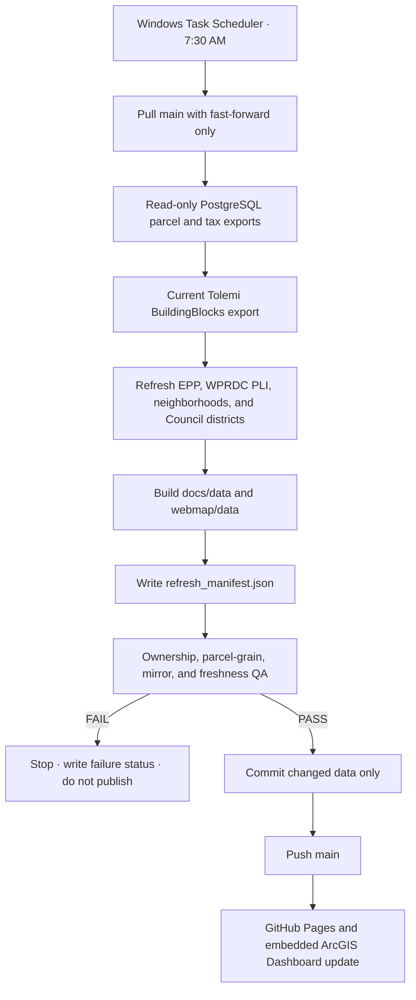

# Daily Refresh VM Operations

The production refresh should run on the secured GIS VM at **7:30 AM America/New_York**. The VM is the correct control plane because the pipeline needs read-only access to internal PostgreSQL and must keep database credentials out of GitHub Pages and GitHub-hosted runners.

The 7:30 slot avoids competing with LandCare's 7:00 VM task and the repository's legacy Monday 11:00 UTC workflow window.

## Daily flow



The browser's **Sources & freshness** panel reads `data/refresh_manifest.json` with cache disabled. Dates therefore advance from pipeline artifacts instead of being hard-coded in JavaScript.

## One-time VM setup

1. Clone the repository to `C:\srv\GISWebApp\land_redevelopment_dashboard`.
2. Install Git, Python 3, Node.js, and the PostgreSQL client.
3. Copy `.env.example` to `.env` and fill in the approved read-only PostgreSQL account.
4. Ensure the scheduled-task service account has repository read/write access and can reach PostgreSQL, Tolemi, WPRDC, ArcGIS REST, and GitHub.
5. Run one manual refresh, review its status, then register the task.

```powershell
cd C:\srv\GISWebApp\land_redevelopment_dashboard
Copy-Item .env.example .env
notepad .env

.\scripts\refresh_vacant_land_dashboard.ps1 `
  -RepoRoot C:\srv\GISWebApp\land_redevelopment_dashboard

.\scripts\register_vacant_land_daily_refresh_task.ps1 `
  -RepoRoot C:\srv\GISWebApp\land_redevelopment_dashboard `
  -TaskUser "DOMAIN\vacant-land-refresh" `
  -PromptForTaskPassword `
  -StartTime "07:30"
```

Use an approved service account, not a personal interactive account. The registration stores a password-backed principal so the task can run while logged off, starts missed runs when the VM becomes available, retries three times at 15-minute intervals, ignores overlapping runs, and stops after two hours.

## Verification

```powershell
Start-ScheduledTask -TaskPath "\GIS Automations\" -TaskName "Vacant-Land-Daily-Dashboard-Refresh"

Get-ScheduledTaskInfo `
  -TaskPath "\GIS Automations\" `
  -TaskName "Vacant-Land-Daily-Dashboard-Refresh" |
  Select-Object LastRunTime, LastTaskResult, NextRunTime

Get-Content C:\srv\logs\land-redevelopment-dashboard\daily-refresh-status.json -Raw |
  ConvertFrom-Json
```

A healthy run has `status: success`, `outcome: published` or `unchanged`, a same-day `run_date`, and `LastTaskResult` equal to `0`. The live manifest must show `qaStatus: PASS` and today's `generatedOn` date.

## Logs and failure behavior

| Artifact | Location |
| --- | --- |
| Current status | `C:\srv\logs\land-redevelopment-dashboard\daily-refresh-status.json` |
| Daily status history | `C:\srv\logs\land-redevelopment-dashboard\daily-refresh-status-YYYY-MM-DD.json` |
| Full transcript | `C:\srv\logs\land-redevelopment-dashboard\daily-refresh-YYYY-MM-DD.log` |

The pipeline fails closed. It does not publish if the tracked worktree is dirty, PostgreSQL/EPP refresh fails, a required source artifact is missing or more than two days old, docs/webmap outputs differ, the parcel count falls below 20,000, parcel PINs duplicate, geometries are missing, ownership QA fails, or Git push fails.

## GitHub Actions role

The existing GitHub workflow can remain a manually triggered or secondary check only when its secrets and network path are approved. The secured VM task is the production morning refresh because GitHub-hosted runners should not be given a direct route to internal PostgreSQL merely for convenience.
