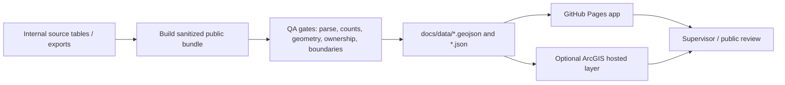

# LandCare Web App Patterns For Vacant Land Triage

Last updated: 2026-07-07

This note copies the useful implementation knowledge from the LandCare assurance dashboard into this repository so the vacant land triage map can reuse the same product patterns without dragging over LandCare-specific data assumptions.

Use this as a web app template and porting checklist for the next round of vacant land dashboard work.

## What To Reuse

| Pattern | LandCare source | How to adapt for vacant land triage |
|---|---|---|
| Operational dashboard shell | `land-care-assurance/docs/monitoring/index.html`, `docs/kpi/index.html` | Keep the compact header, tab navigation, freshness/status text, map-first layout, and right-side analysis panel. |
| Shared visual system | `land-care-assurance/docs/landcare/app.css` | Reuse tokens, cards, chart/table density, warnings, source strips, and responsive rules. Rename classes only where this app already has a convention. |
| PDF export workflow | `land-care-assurance/docs/landcare/monitoring.js` | Port the print pipeline so exports include the current map, current filters, contextual legend, key metrics, source note, and generated timestamp. |
| Spreadsheet export workflow | Tolemi parcel-list export pattern | Add a current-filter parcel export with rich public-safe columns for parcel review, QA, and handoff. |
| Metrics context discipline | `land-care-assurance/docs/landcare-metrics-context.md` | Create a vacant-land version that defines parcel counts, delinquency bands, ownership groups, public/private control, and denominators. |
| Data engineering flow documentation | `land-care-assurance/docs/landcare-data-engineering-flow.md` | Mirror the source ownership table and refresh diagram for vacant land extracts, public layers, ownership QA, and GitHub Pages outputs. |
| Daily/weekly ops runbook style | `land-care-assurance/docs/task-scheduler-vm-operations.md` | Use the same structure for scheduled refresh, status artifacts, logs, QA gates, and handoff instructions. |

## Product Principles To Carry Forward

- Keep the map as the main work surface; analysis explains the current map state instead of competing with it.
- Show freshness and source status quietly in the header or a compact strip.
- Put detailed metric definitions in Markdown, not inside dashboard cards.
- Separate "raw source records" from "dashboard denominator records" whenever a join or eligibility rule exists.
- Use short labels in the UI and precise definitions in docs.
- Keep public-facing output sanitized; internal owner names, operational notes, and sensitive fields should stay out unless explicitly approved.
- Make export output self-contained enough for supervisor review: title, date, filters, map image, legend, key numbers, and source note.
- Make spreadsheet output self-contained enough for parcel review: one row per visible parcel, clear public-safe columns, active filters, source note, and generated timestamp.

## Suggested App Structure

The current repo already uses `docs/` as the GitHub Pages root. Keep that contract.

```text
docs/
  index.html
  styles.css
  app.js
  data/
    vacant_land_triage.geojson
    ownership_analysis.json
    boundary_analysis.json
    refresh_manifest.json       # recommended if not already present
  assets/
    ura-logo.png
  vacant-land-metrics-context.md # recommended
  vacant-land-data-flow.md       # recommended
```

If the app grows into multiple pages, use the LandCare pattern:

```text
docs/
  monitoring/
    index.html
  kpi/
    index.html
  landcare/                     # LandCare used a shared folder
    app.css
    monitoring.js
    kpi.js
```

For this repo, the equivalent could be:

```text
docs/
  triage/
    index.html
  kpi/
    index.html
  vacant-land/
    app.css
    triage.js
    kpi.js
    data-sources.js
```

## Reusable HTML Shell

Use a compact app shell rather than a marketing landing page. This is the template shape to copy.

```html
<header class="app-header">
  <a class="brand" href="../">
    
    <div class="title-block">
      <strong>Vacant Land Triage</strong>
      <span>Redevelopment screening dashboard</span>
    </div>
  </a>

  <nav class="page-tabs" aria-label="Dashboard sections">
    <a class="is-active" href="./">Map</a>
    <a href="../kpi/">KPI</a>
    <a href="../latest_ownership_qa.md">QA</a>
  </nav>

  <p class="freshness" id="sourceFreshness">
    Data loading
  </p>
</header>

<main class="app-shell">
  <aside class="control-panel">
    <section class="panel">
      <div class="panel-head">
        <h2>Filters</h2>
      </div>
      <!-- use segmented controls, select menus, checkboxes, and compact chips -->
    </section>

    <section class="panel">
      <div class="panel-head">
        <h2>Legend</h2>
      </div>
      <div class="legend-list" id="legendList"></div>
    </section>
  </aside>

  <section class="map-stage">
    <div id="viewDiv"></div>
  </section>

  <aside class="detail-panel">
    <section class="panel">
      <div class="panel-head">
        <h2>Selection</h2>
      </div>
      <div id="selectionSummary"></div>
    </section>
  </aside>
</main>
```

## Styling System To Port

LandCare's dashboard style is useful because it feels like an operational tool: compact, readable, and not over-decorated.

### Tokens

Use URA blue as the brand anchor, with restrained neutral surfaces and semantic status colors.

```css
:root {
  --ura-blue: #0098d3;
  --ura-blue-dark: #006c9f;
  --ura-deep: #00334f;
  --paper: #ffffff;
  --canvas: #f4f7f9;
  --ink: #1e2f3a;
  --muted: #667985;
  --line: #d8e2e8;
  --green: #2e7d32;
  --orange: #c76a25;
  --orange-soft: #fff4ec;
  --shadow: 0 10px 30px rgba(14, 38, 51, 0.12);
  --header-height: 64px;
}
```

### Core UI Rules

| Element | Guidance |
|---|---|
| Header | Use a compact grid: brand, page tabs, freshness/status. Avoid long explanatory copy. |
| Source/freshness strip | Show source status and last refresh in one line where possible. Example: `Vacant parcels: GitHub export | Ownership: reference layer | Refreshed 2026-07-07`. |
| Panels | Use simple white surfaces, 1px border, 8px radius or less. Do not nest cards inside cards. |
| KPI cards | First row should be decision metrics. Put inventory/source counts lower. |
| Warnings | Use small inline status treatments, not full-page alerts unless core static data cannot load. |
| Tables | Sort by the main operational burden by default. Keep labels short. |
| Empty states | Explicitly say what is missing: `No parcels match the current filters`. |
| Charts | Use fixed axes when interpreting rates. Completion/rate charts should max at 100%. |

### Useful Class Patterns

```css
.app-header {
  display: grid;
  grid-template-columns: auto minmax(0, 1fr) auto;
  align-items: center;
  gap: 18px;
  min-height: var(--header-height);
  padding: 10px 18px;
  background: var(--ura-deep);
  color: #ffffff;
}

.page-tabs {
  display: flex;
  gap: 6px;
}

.page-tabs a {
  display: inline-flex;
  align-items: center;
  justify-content: center;
  min-height: 34px;
  padding: 0 12px;
  border-radius: 6px;
  color: rgba(255, 255, 255, 0.86);
  font-weight: 800;
  text-decoration: none;
}

.page-tabs a.is-active,
.page-tabs a:hover {
  color: var(--ura-deep);
  background: #ffffff;
}

.freshness {
  max-width: 320px;
  color: rgba(255, 255, 255, 0.82);
  font-size: 11px;
  font-weight: 800;
  line-height: 1.35;
  text-align: right;
}

.panel,
.metric-card,
.reference-card {
  background: var(--paper);
  border: 1px solid var(--line);
  border-radius: 8px;
  box-shadow: var(--shadow);
}

.metric-card.primary,
.reference-card.primary {
  background: linear-gradient(145deg, var(--ura-blue) 0%, var(--ura-blue-dark) 100%);
  border-color: transparent;
  color: #ffffff;
}

.legend-list {
  display: grid;
  gap: 7px;
}

.legend-item {
  display: grid;
  grid-template-columns: 12px minmax(0, 1fr) auto;
  gap: 8px;
  align-items: center;
}

.legend-swatch {
  width: 10px;
  height: 10px;
  border-radius: 50%;
}

@media (max-width: 860px) {
  .app-header {
    grid-template-columns: auto minmax(0, 1fr);
  }

  .page-tabs,
  .freshness {
    grid-column: 1 / -1;
  }

  .freshness {
    max-width: none;
    text-align: left;
  }
}
```

## PDF Export Feature Template

LandCare's export is worth porting because it creates a supervisor-ready PDF from the current dashboard state, not a generic browser print.

### What The Export Should Include

| Section | Vacant-land version |
|---|---|
| Title | `Vacant Land Triage Map` or current module name |
| Generated timestamp | Local timestamp at export time |
| Current filters | Use group, delinquency band, ownership/control group, geography filter |
| Map image | Screenshot of the current ArcGIS view after layers settle |
| Contextual legend | Match current map color mode, such as delinquency, ownership, use group, or acquisition readiness |
| Key metrics | Visible parcel count, candidate count, public/private split, selected geography totals |
| Action focus | Top areas or parcels needing review under current filters |
| Source footer | Data extract date, source layer/file names, and public-sanitized caveat |

## Spreadsheet Export Feature Template

Add a Tolemi-style spreadsheet export for parcel-level follow-up. Unlike the PDF, this export is for staff review and handoff, so it should prioritize clear columns and reproducibility over visual layout.

### What The Spreadsheet Export Should Include

| Column group | Vacant-land version |
|---|---|
| Export context | Generated timestamp, active signal mode, active filters, selected geography/view where available |
| Parcel identity | Parcel ID/PIN, display parcel label |
| Triage signals | Use group, prior-year band, prior-year count, tax status, ownership group, control path, condemned flag/status band |
| Geography | City neighborhood, Council district label, ZIP if available |
| Parcel facts | Acreage, fair market value, public-safe assessment/use description |
| Source/caveat | Data bundle/source label and public-safe screening caveat |

Recommended output formats:

- `CSV` for browser-native export with no dependencies.
- `.xlsx` only if a future build adds a tested client-side workbook library or server-side/internal export step.

Public mode must not export owner names, addresses, internal notes, detailed delinquency account records, staff comments, or operational strategy fields unless an explicitly approved internal mode is active.

The spreadsheet must use the same filtered feature set as the map and dashboard metrics. If the user filters to condemned overlap or switches to ownership mode, exported rows and context columns should reflect that exact state.

### Port The Function Pattern

The LandCare implementation is organized around these functions:

| Function | Role |
|---|---|
| `exportPrintPdf()` | Main click handler: disables button, updates progress, captures map image, opens print document, restores UI. |
| `captureMapImage()` | Waits for map/layers to settle and returns a screenshot data URL. |
| `exportStats(features)` | Computes summary numbers from the currently filtered feature set. |
| `printLegendHtml()` | Builds a legend that reflects the current map color mode or selected contractor/filter. |
| `buildPrintHtml(mapImage, stats, screenshotScale)` | Creates the print-only HTML document. |
| `buildPreparingPrintHtml()` | Gives the pop-up a loading state while the screenshot is being prepared. |
| `updatePrintProgress()` | Shows short UI progress text near the export button. |

Vacant-land naming can be clearer:

```js
async function exportCurrentMapPdf() {
  const button = document.getElementById("exportPdfButton");
  const status = document.getElementById("exportStatus");
  const previousLabel = button.textContent;

  button.disabled = true;
  button.textContent = "Preparing";

  try {
    updatePrintProgress("Preparing map");
    const printWindow = window.open("", "_blank", "noopener,noreferrer");
    if (!printWindow) {
      throw new Error("Popup blocked");
    }

    printWindow.document.write(buildPreparingPrintHtml());
    printWindow.document.close();

    const visibleFeatures = getVisibleFeatures();
    const stats = exportStats(visibleFeatures);
    const { dataUrl, scale } = await captureMapImage();

    updatePrintProgress("Opening print layout");
    printWindow.document.open();
    printWindow.document.write(buildPrintHtml(dataUrl, stats, scale));
    printWindow.document.close();
    printWindow.focus();

    setTimeout(() => printWindow.print(), 500);
    updatePrintProgress("PDF ready");
  } catch (error) {
    console.error(error);
    updatePrintProgress("Export failed");
  } finally {
    button.disabled = false;
    button.textContent = previousLabel;
  }
}
```

### Contextual Legend Requirement

The legend in the PDF must match the current map view. Do not export a static legend if the user changed the color mode.

Recommended color modes for vacant land triage:

| Color mode | Legend should show |
|---|---|
| Prior-year delinquency | `No known prior years`, `1-4`, `5-10`, `11+` |
| Use group | Residential, commercial, industrial, public/institutional, infrastructure/utility, review |
| Ownership/control | Private, City, URA, PLB, HACP, other public, unknown |
| Acquisition readiness | Candidate, watchlist, context only, excluded |
| Selected geography | Selected neighborhood/district/ZIP highlight plus muted non-selected parcels |

Example legend builder:

```js
function printLegendHtml() {
  const mode = state.colorMode;
  const items = legendItemsForMode(mode, state.filters);

  return `
    <section class="print-card">
      <h2>Legend</h2>
      <div class="print-legend">
        ${items.map((item) => `
          <div class="print-legend-item">
            <span style="background:${item.color}"></span>
            <strong>${escapeHtml(item.label)}</strong>
            <em>${formatNumber(item.count)}</em>
          </div>
        `).join("")}
      </div>
    </section>
  `;
}
```

### Print CSS Shape

Use a print-only layout so the PDF looks intentional.

```css
@page {
  size: A3 landscape;
  margin: 0.35in;
}

body {
  margin: 0;
  color: #1e2f3a;
  font-family: Arial, sans-serif;
  background: #eef3f6;
}

.print-page {
  display: grid;
  grid-template-columns: 1.5fr 0.7fr;
  gap: 14px;
}

.print-map {
  min-height: 620px;
  border: 1px solid #c9d7df;
  background: #ffffff;
}

.print-card {
  border: 1px solid #d8e2e8;
  border-radius: 8px;
  background: #ffffff;
  padding: 12px;
}
```

## Data And Metrics Knowledge To Copy

LandCare became easier to trust once each count had a denominator and owner. Vacant land triage needs the same discipline.

Create a `docs/vacant-land-metrics-context.md` file with this table shape:

| Metric | Definition | Source | Notes |
|---|---|---|---|
| Public mapped vacant parcels | Sanitized parcels published to GitHub Pages | `docs/data/vacant_land_triage.geojson` | Public-safe view, not the full internal database. |
| Residential parcels | Published parcels where `use_group = Residential` | GeoJSON export | Default public view if residential remains the primary review mode. |
| Acquisition candidates | Parcels meeting the agreed delinquency/control threshold | Exported analysis fields | Should not be treated as final legal eligibility. |
| Long delinquency parcels | Parcels in the `11+ prior years` band | Tax/delinquency source field | Useful for prioritization, not final action. |
| Public/control group counts | Parcels grouped by owner/control classification | Ownership QA/export | Distinguish City, URA, PLB, HACP, other public, private, unknown. |
| Selected geography count | Visible parcels inside selected neighborhood, council district, or ZIP | Boundary join/export plus app filter | Confirm spatial join source and date. |

Also document the denominator rules:

- Do not compare public-sanitized parcel counts to internal database totals unless the filter and exclusion rules are identical.
- Do not treat tax delinquency as acquisition eligibility without legal/source review.
- Do not mix ZIP penetration rates with parcel-count rankings without showing the denominator.
- Public ownership/control is a classification signal, not a promise that a parcel is available for redevelopment.
- A selected map subset should always say which filters are active.

## Source And Refresh Pattern

LandCare's strongest operational pattern is the explicit source contract. Vacant land should use a similar source table.

| Source area | Owner/source | App role | Refresh expectation |
|---|---|---|---|
| Vacant parcel extract | PostGIS or approved export pipeline | Primary map features | Weekly or approved cadence |
| Ownership/control reference | Ownership Overview / internal source | Public/private/control grouping | Validate before publishing |
| Tax delinquency fields | Source export / tax status enrichment | Prior-year bands and acquisition screening | Refresh with source cadence |
| Boundaries | City neighborhoods, Council districts, ZIP | Geography filters and charts | Stable reference, refresh when source changes |
| GitHub Pages data | `docs/data/*` | Public app contract | Commit only after QA passes |
| ArcGIS hosted layer | Optional map publishing target | Familiar web map and layer reuse | Keep item IDs and service URLs documented |

Recommended flow:



## Failure And Empty State Rules

| Failure | App behavior |
|---|---|
| Static GeoJSON cannot load | Show a clear data-load failure and stop parcel metrics. |
| Boundary JSON cannot load | Keep parcel map usable; hide affected boundary charts and show a small warning. |
| Optional ArcGIS layer cannot load | Keep GitHub Pages static data usable; show a source warning. |
| No features match filters | Show empty map/list state: `No parcels match the current filters`. |
| PDF screenshot fails | Keep app usable; show `Export failed` near the button and log the error. |
| Spreadsheet export has no rows | Keep app usable; show `No parcels match the current filters` near the export control and do not download an empty file unless the user explicitly asks. |
| QA count changes unexpectedly | Block publish until reviewed. |

## Porting Checklist

- [ ] Decide whether the next vacant-land version is single-page or split into Map and KPI pages.
- [ ] Add a compact source/freshness strip to the header.
- [ ] Define canonical metric names and denominators in `docs/vacant-land-metrics-context.md`.
- [ ] Add or update `refresh_manifest.json` with generated date, source extract date, parcel count, and QA status.
- [ ] Reuse the LandCare card/table/chart density, but keep labels vacant-land specific.
- [ ] Add map color modes with a single `legendItemsForMode()` function.
- [ ] Port PDF export with contextual legend and active filter summary.
- [ ] Add spreadsheet export for the current filtered/visible parcel set with a stable public-safe column manifest.
- [ ] Keep public-safe fields only in `docs/data`.
- [ ] Run JS syntax checks before publish.
- [ ] Serve `docs/` locally and verify the app, filters, charts, PDF export, and spreadsheet export.

## Acceptance Criteria

Before treating the port as complete:

- The app loads from `docs/index.html` without a build step.
- Source/freshness status says what was refreshed and when.
- Map legend and PDF legend match the active color mode.
- KPI/rate charts use bounded axes where appropriate, especially any percent chart capped at 100%.
- Empty states are visible and plain.
- PDF export works after filter changes and includes the active filter context.
- Spreadsheet export works after filter changes and includes the active filter context, parcel ID/PIN, public-safe triage fields, geography fields, and source/caveat columns.
- Public data files parse and do not expose internal-only fields.
- Documentation explains what each core metric counts and what it should not be compared against.
